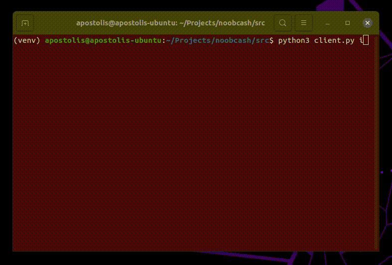
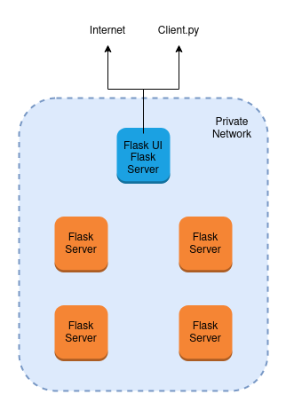

# Noobcash

This project was developed in the context of undergrad course "Distributed Systems" at NTUA

It is a simple blockchain cryptocurrency, implemented with flask over REST API

| Authors                                                                |
|------------------------------------------------------------------------|
| Apostolis Stamatis ([@apostolis1](https://github.com/apostolis1))      |
| Dimitrios Mitropoulos ([@dimitrismit](https://github.com/dimitrismit)) |

## Installation

All the required packages are included in `requirements.txt`, simply install them with 

`pip3 install -r requirements.txt`

After that, you can start the flask server with the command

`python3 rest.py -p PORT_HERE -i IP_HERE`

Both the `-p` and `-i` parameters are optional

Please note that only the bootstrap node should be running on port 5000 due to a hardcoded 
check and that bootstrap's server should be the first one to start since all the other servers
are using its `/register` endpoint

## Client

A cli interface is implemented for users that offers the following functionalities:
- Make new transactions
- View wallet balances
- View transactions included in last block

There are two different ways the user can use the client:
### Interactive
The more user-friendly approach, started with `python3 client.py i`

A demo can be seen below (the quality is low due to gif encoding)

### CLI 
The options provided are:
- `python3 client.py t -s SENDER_ID -r RECEIVER_ID -a AMOUNT` to create new transaction
- `python3 client.py view` to view the transactions included in the last block
- `python3 client.py balance` to view each wallet's balance
- `python3 client.py f -s SENDER_ID --file TRANSACTIONS_FILE` to create transactions from file

Note that the client is communicating directly with the corresponding server when creating a new transaction 
(either a single one or reading from the file)

This means that if the corresponding server is only reachable from inside a private network, the client should be run
from inside the private network as well

## Testing

Unittest is used for testing

From the /src diretory run

``python3 -m unittest discover -s ../tests/``

## Network Infrastructure

Below is the infrastructure we used for our benchmarks with 5 nodes (a similiar one was used for the case of 10 nodes)

